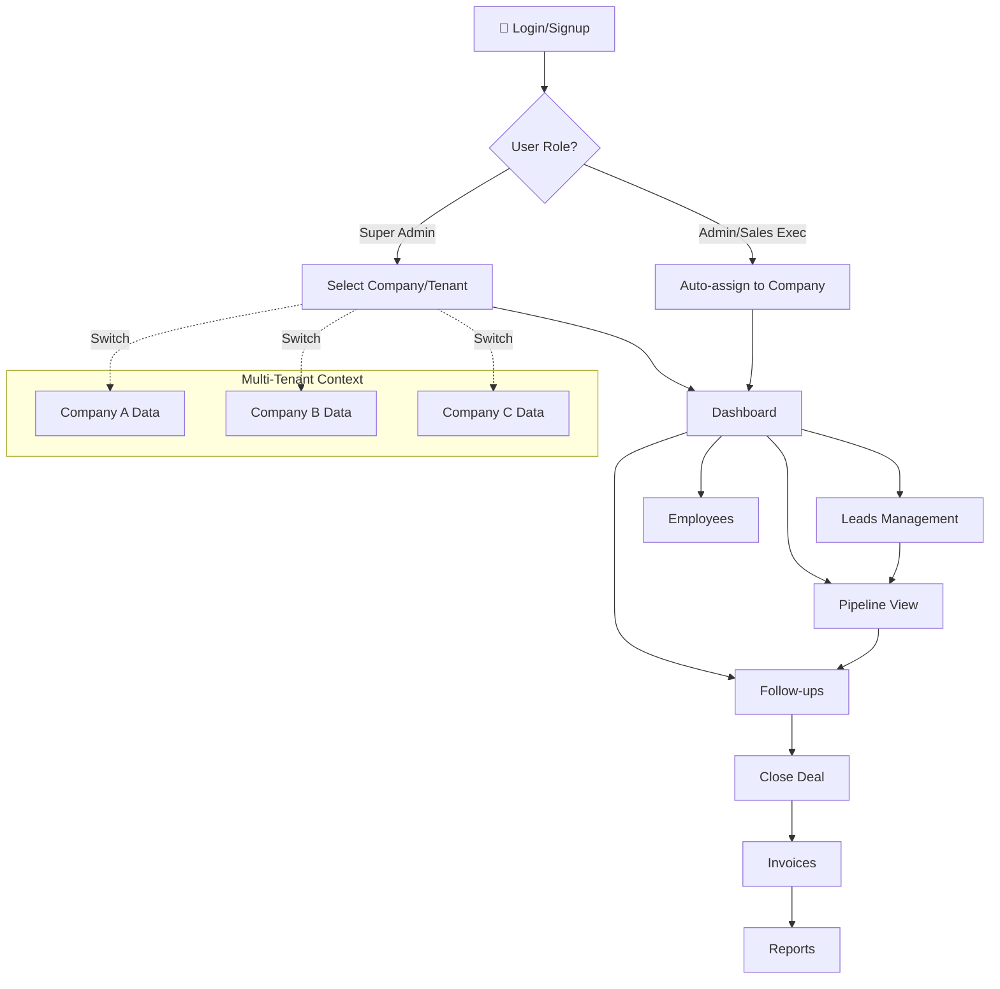

# Lead Management CRM

A modern lead management and CRM application built with React, TypeScript, and Tailwind CSS.

## Features

- 📊 Dashboard with analytics and charts
- 👥 Lead management with table and pipeline views
- 📝 Lead notes and comments tracking
- 📅 Follow-up scheduling and reminders
- 📄 Invoice management
- 📈 Reports and analytics

## How to Install

### Prerequisites

- **Node.js** (v18 or higher) - [Download here](https://nodejs.org/)
- **npm** (comes with Node.js) or **bun** package manager

### Installation Steps

1. **Clone the repository**
   ```bash
   git clone <YOUR_GIT_URL>
   cd <YOUR_PROJECT_NAME>
   ```

2. **Install dependencies**
   ```bash
   npm install
   # or if using bun
   bun install
   ```

3. **Start the development server**
   ```bash
   npm run dev
   # or if using bun
   bun run dev
   ```

4. **Open in browser**
   
   Navigate to `http://localhost:5173` to view the application.

### Build for Production

```bash
npm run build
# or
bun run build
```

The production files will be in the `dist` folder.

### Preview Production Build

```bash
npm run preview
# or
bun run preview
```

## How to Use This App

### App Flow Overview



**Simplified Flow:**
```
Login → Select Company (if Super Admin) → Dashboard → Leads → Pipeline → Follow-ups → Invoices → Reports
```

### Multi-Tenant Architecture

This CRM supports multiple companies (tenants) with isolated data:

- **Super Admin**: Can view and manage ALL companies, switch between tenants using the company selector
- **Admin**: Manages their assigned company's data and employees
- **Sales Executive**: Works within their assigned company's leads and pipeline

### Step-by-Step Guide

#### 1. Authentication & Tenant Selection
- **Login/Signup**: Create an account or login with existing credentials
- **Company Selection** (Super Admin only): Use the company dropdown in the header to switch between companies
- **Automatic Context**: Admins and Sales Executives are automatically scoped to their company

#### 2. Dashboard (Home)
- View key metrics: total leads, pipeline value, conversion rates (filtered by active tenant)
- See recent leads and upcoming follow-ups at a glance
- Monitor lead sources and revenue trends through charts
- All data respects tenant boundaries

#### 3. Leads Management
- **Add New Lead**: Click "Add Lead" button - leads are automatically associated with the active company
- **View Leads**: Browse all leads in a table format with sorting and filtering (tenant-filtered)
- **Edit Lead**: Click on any lead to update their information
- **Contact Actions**: Quick actions to call, email, or WhatsApp leads directly
- **Add Notes**: Track all interactions and conversations with each lead
- **CSV Import**: Bulk import leads with automatic tenant assignment

#### 4. Pipeline View
- **Visual Pipeline**: See all leads organized by status columns (New → Contacted → Follow-up → Interested → Proposal → Won/Lost)
- **Drag & Drop**: Move leads between stages by dragging cards
- **Quick Stats**: View total leads, pipeline value, and conversion rates for the active tenant
- **Lead Details**: Click any lead card to view full details and add notes

#### 5. Follow-ups
- View scheduled follow-up reminders for the active tenant
- Track pending and completed follow-ups
- Never miss an important client interaction

#### 6. Employees (Multi-Tenant)
- **View Team**: See employees assigned to the active company
- **Add Employee**: Invite new team members to the current company
- **Role Management**: Assign roles (Admin, Sales Executive) within the company
- **Super Admin View**: See all employees across all companies

#### 7. Companies
- **Manage Companies**: Super Admins can create and manage multiple companies
- **Company Settings**: Configure company-specific settings

#### 8. Invoices
- Manage invoices for won deals (tenant-scoped)
- Track payment status and history

#### 9. Reports
- Analyze sales performance for the active tenant
- View trends and insights
- Export data for further analysis

### Typical User Workflow

#### For Sales Executives:
1. **Login** → Automatically scoped to assigned company
2. **Capture Lead** → Add new lead from website inquiry, referral, or cold call
3. **Initial Contact** → Move to "Contacted" after first interaction
4. **Follow-up** → Schedule and track follow-ups in the system
5. **Nurture** → Add notes for each interaction, move through pipeline stages
6. **Close Deal** → Mark as "Won" and create invoice
7. **Analyze** → Review reports to improve sales process

#### For Admins:
1. **Login** → Access company dashboard
2. **Manage Team** → Add/remove employees, assign roles
3. **Monitor Pipeline** → Track all sales activities
4. **Review Reports** → Analyze team performance

#### For Super Admins:
1. **Login** → Access global dashboard
2. **Select Company** → Switch between companies using the header dropdown
3. **Manage All** → Access all company data, employees, and settings
4. **Cross-Company Reports** → View aggregate performance metrics

## Tech Stack

- **React** - UI framework
- **TypeScript** - Type safety
- **Vite** - Build tool
- **Tailwind CSS** - Styling
- **shadcn/ui** - UI components
- **React Router** - Navigation
- **Recharts** - Charts and graphs
- **React Hook Form** - Form handling
- **date-fns** - Date utilities
- **@dnd-kit** - Drag and drop functionality

## Project Structure

```
src/
├── components/     # Reusable UI components
│   ├── dashboard/  # Dashboard-specific components
│   ├── layout/     # Layout components (Header, Sidebar)
│   ├── leads/      # Lead management components
│   └── ui/         # shadcn/ui components
├── data/           # Mock data
├── hooks/          # Custom React hooks
├── lib/            # Utility functions
├── pages/          # Page components
└── types/          # TypeScript types
```

## Deployment

Simply open [Lovable](https://lovable.dev/projects/REPLACE_WITH_PROJECT_ID) and click on Share -> Publish.

## Custom Domain

To connect a custom domain, navigate to Project > Settings > Domains and click Connect Domain.

Read more here: [Setting up a custom domain](https://docs.lovable.dev/features/custom-domain#custom-domain)
